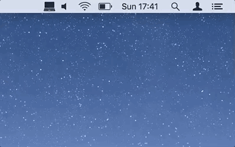

Have you ever started playing music accidentally from your laptop speakers thinking it would come out from your headphones?

Where’s My Sound adds an icon in the menu bar of your macOS desktop showing what kind of device is currently selected for playing audio.

